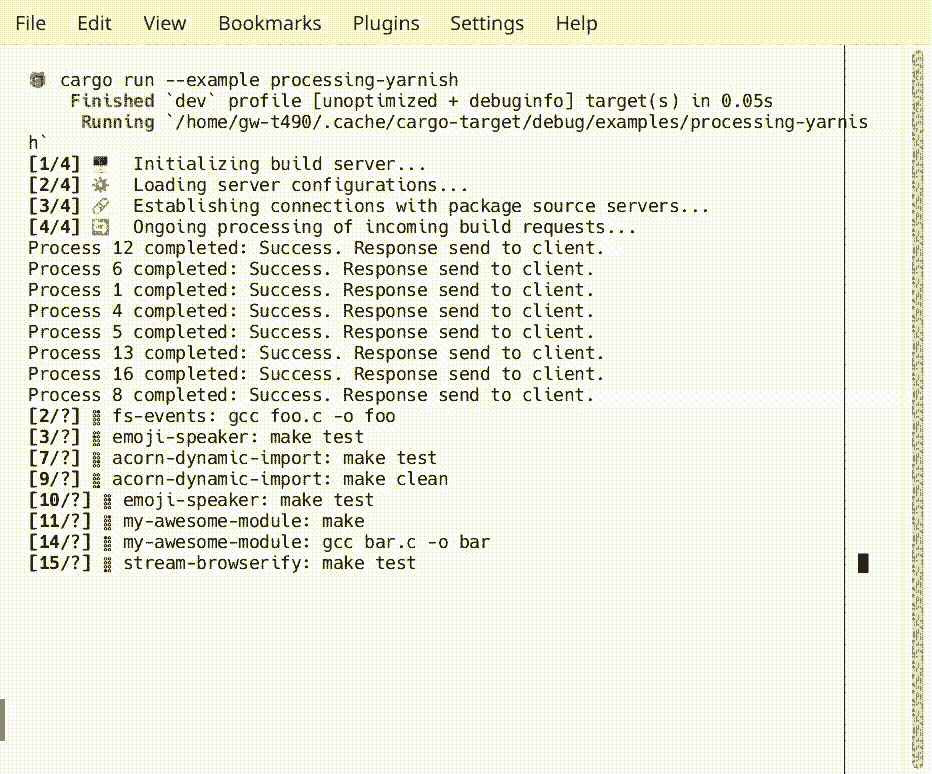
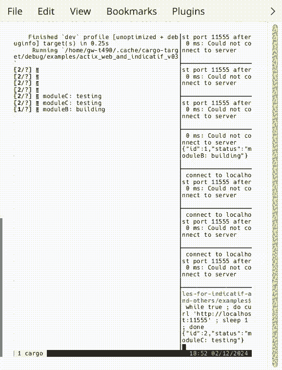

# Educational Examples for Indicatif

> **Note**: This is an educational fork focusing on additional examples. For the latest version of the library, please visit the [original repository](https://github.com/console-rs/indicatif).

This repository contains supplementary educational examples for Indicatif - a powerful command line progress reporting library for Rust. After discussions in [PR #672](https://github.com/console-rs/indicatif/pull/672), I decided to make this separate collection of examples that showcase Indicatif's examples, both standalone and in combination with other libraries.

The goal is to provide additional learning resources and practical demonstrations beyond the core examples in the main repository.

Some of added examples screencasts:

## `processing-yarnish.rs` example




## `actix_web_and_indicatif_v03.rs` example

```
bash examples/actix_web_and_indicatif_v03_demo.sh
```

or handy with cloning repo into temp dir:

```
cd `mktemp -d --suffix=.indicatif-actix-tmux-demo` && git clone https://github.com/edu-samples/edu-examples-for-indicatif-and-others.git && cd edu-examples-for-indicatif-and-others/examples && ./actix_web_and_indicatif_v03_demo.sh
```

will lanuch tmux with `actix_web` example server
and multiple curl loops making requests to it.

So it is demo of `actix_web` integration,
but ofc workload of server is simulated.

Server is returning JSONL (jsonlines.org)
streaming updates of status as progress bars are updated:




# Below original README part:

# indicatif

[](https://docs.rs/indicatif/)
[](https://crates.io/crates/indicatif)
[](https://github.com/console-rs/indicatif/actions/workflows/rust.yml)
[](https://discord.gg/YHmNA3De4W)

A Rust library for indicating progress in command line applications to users.

This currently primarily provides progress bars and spinners as well as basic
color support, but there are bigger plans for the future of this!

## Examples

[examples/yarnish.rs](examples/yarnish.rs)


[examples/download.rs](examples/download.rs)


[examples/multi.rs](examples/multi.rs)


[examples/single.rs](examples/single.rs)


## Integrations

You can use [indicatif-log-bridge](https://crates.io/crates/indicatif-log-bridge) to integrate with the
[log crate](https://crates.io/crates/log) and avoid having both fight for your terminal.
